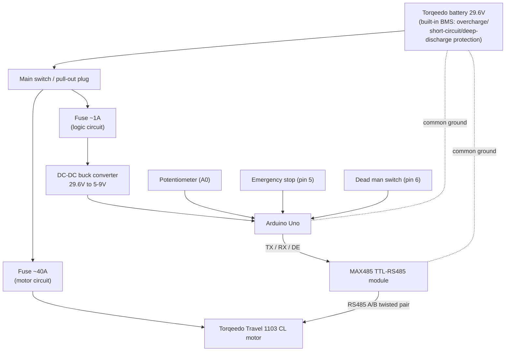

# Torqeedo motor

Arduino sketch that drives a Torqeedo motor over RS485, with a potentiometer for speed control and two safety switches (emergency stop and dead man switch).

## Hardware

Components:

- Arduino Uno
- MAX485 TTL-RS485 module
- Potentiometer (speed control)
- Emergency stop button (normally closed)
- Dead man switch (normally open)
- Torqeedo Travel 1103 CL motor

Pins:

- `2` — RS485 TX (to MAX485 `DI`)
- `3` — RS485 RX (to MAX485 `RO`)
- `4` — RS485 DE (driver enable, to MAX485 `DE`+`RE`)
- `A0` — potentiometer wiper (speed control)
- `5` — emergency stop (normally closed button between pin and GND)
- `6` — dead man switch (normally open button between pin and GND)

### System diagram

Intended full setup, powered from the Torqeedo battery pack:

Notes:

- Two **separate fuses**: a heavy one (~40A) for the motor circuit and a small one
  (~1A) for the logic circuit. A single shared fuse is risky — a motor current
  spike could take down the Arduino's power too.
- The Uno is powered from the same battery as the motor, via a DC-DC buck
  converter (29.6V → 5-9V), not from an independent power source.
- A main switch / pull-out plug in front of everything lets you fully de-energize
  the system, independent of the software emergency stop on pin 5.
- The battery, Uno and TTL module must share a **common ground** — easy to
  forget, but required for the RS485 signal reference to work reliably.

### RS485 wiring

A cheap MAX485 breakout module is used to convert the Arduino's UART signal to the
RS485 bus. On these modules DE and RE are usually tied together, so a single
Arduino pin can drive both:

| Arduino Uno | MAX485 module     |
| ----------- | ------------------ |
| `5V`        | `VCC`               |
| `GND`       | `GND`               |
| `2` (TX)    | `DI`                 |
| `3` (RX)    | `RO`                 |
| `4` (DE)    | `DE` + `RE` (tied together) |
| —           | `A` / `B` → to the Torqeedo RS485 bus |

Check the `A`/`B` polarity against the Torqeedo motor's connector documentation —
if the motor doesn't respond, try swapping `A` and `B`.

### Torqeedo model

Target motor: **Torqeedo Travel 1103 CL** (long-shaft). This sketch has **not yet
been tested against the real motor**. It's based on ArduPilot's documented
`AP_Torqeedo` protocol, but hasn't been validated against this specific model
and firmware version yet. Test carefully, without load, before relying on it.

### ⚠️ Safety

This sketch controls a real motor, potentially on a boat. Bugs, wiring mistakes,
or protocol misunderstandings can cause unexpected motor behavior. Always:

- Test on the bench, out of the water, with the propeller removed or the boat secured, before any on-water use.
- Verify the emergency stop and dead man switch actually cut power before trusting them.
- Use at your own risk — this project comes with **no warranty**, see [LICENSE](LICENSE).

## How it works

- Reads the potentiometer and drives the motor via an RS485 protocol with a CRC8 checksum.
- Speed is ramped up/down gradually (soft start/stop, max 10 units per 100 ms).
- The motor stops immediately on emergency stop or when the dead man switch is released.
- A watchdog timer (2 s) restarts the Arduino if the loop hangs.
- The number of errors/stops is tracked in EEPROM.

## Libraries

Only standard Arduino libraries are needed, no external dependencies:

- `SoftwareSerial`
- `EEPROM`
- `avr/wdt`

## Uploading

Open `Torqeedo_motor.ino` in the Arduino IDE (or use `arduino-cli`), select board **Arduino Uno**, and upload.

## Credits

The RS485 bus protocol (framing bytes `0xAC`/`0xAD`/`0xAE`, CRC8 checksum) is based on
[ArduPilot's `AP_Torqeedo` driver](https://github.com/ArduPilot/ardupilot/tree/master/libraries/AP_Torqeedo).
Many thanks to the ArduPilot project for documenting and implementing the Torqeedo bus protocol.

## License

GPLv3, see [LICENSE](LICENSE) — inherited from ArduPilot's GPLv3-licensed `AP_Torqeedo` driver, on which the protocol implementation is based.
