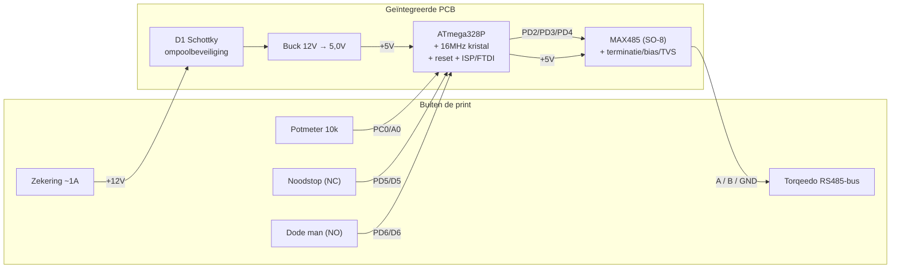

# Geïntegreerde PCB (alles op één print)

Schema-ontwerp voor **één print waarop alles samenkomt**: een kale
**ATmega328P** (geen Arduino-module), de **MAX485**, de **12 V→5 V-voeding**,
de connectoren en de bus-beveiliging. Dezelfde sketch (`Torqeedo_motor.ino`)
draait ongewijzigd op de losse ATmega — de Nano is enkel vervangen door de chip
zelf plus een kristal, reset-circuit en een programmeer-header.

Een **KiCad-project** met zowel het schema als het **uitgewerkte printontwerp**
staat in [`../hardware/kicad/`](../hardware/kicad/) (open `torqeedo_pcb.kicad_pro`).
De print is 100 × 80 mm, 2-laags, volledig gerouteerd met een doorlopend
massavlak op de onderlaag, en DRC-schoon; `hardware/kicad/fab/` bevat de
Gerbers om hem te laten maken. De [hardware-README](../hardware/kicad/README.md)
beschrijft de indeling en wat je vóór bestellen nog moet nakijken.

Dit document geeft de **elektrische** kant (blokschema, connectielijst,
onderdelenlijst). De waterdichte/trillingsbestendige opbouw staat in
[`ip68-robuuste-opbouw.md`](ip68-robuuste-opbouw.md); de pinout en het protocol
in [`torqeedo-1103cl-aansturing.md`](torqeedo-1103cl-aansturing.md); de
voedingstopologie (accu, zekeringen, hoofdschakelaar) in de
[`README`](../README.md).

> ⚠️ Deze print is de **logica + RS485** ("brain"). Het **zware motorpad
> (~40 A, 29,6 V)** en de **40 A-zekering** horen er **niet** op — die lopen
> los langs de print, precies zoals de twee-zekeringen-opzet in de README.
> Op deze print komt alleen de **gelogde ~1 A tak** binnen.

---

## 1. Voeding: 12 V → 5 V

De print wordt gevoed met **12 V** en maakt daar met een buck **5,0 V** van.
Die 5 V voedt de ATmega, de MAX485, de potmeter en de pull-ups.

De 12 V komt van een **12 V-tak** — in de praktijk een 29,6 V→12 V-omvormer
bovenstrooms, of een aparte 12 V-accu aan boord. Alleen de gelogde ~1 A tak
(met de ~1 A-zekering uit de README) komt hier binnen; het 29,6 V motorpad
blijft er volledig van gescheiden.

**Buck als module op de print (aanbevolen).** Monteer een kant-en-klare
12 V→5 V buck-module op headers/pads op dezelfde print. Het blijft één PCB waar
alles samenkomt, maar je vermijdt het lastigste stuk voor een eerste eigen
ontwerp: de layout van een schakelende regelaar (inductor, feedback, ground
return). *Optie:* volledig integreren met een buck-IC (MP2307/MP1584/LM2596 +
inductor + dioden/caps) als je vertrouwd bent met switching-layout.

---

## 2. ATmega328P (U2) — kern

De kale chip vervangt de Nano. Voor betrouwbare SoftwareSerial (19200 baud) is
een **extern 16 MHz-kristal** nodig; de interne 8 MHz-RC-oscillator is te
onnauwkeurig voor stabiele seriële timing. Draai de **Arduino Uno-bootloader**
en dezelfde sketch — de code is 1-op-1 overdraagbaar.

Benodigd rond de chip:

- **Y1 16 MHz-kristal** + **C7/C8 (22 pF)** naar GND, vlak bij XTAL1/XTAL2
  (pin 9/10).
- **Reset:** R8 (10 kΩ) van RESET (pin 1) naar +5 V; optionele reset-knop naar
  GND; C13 (100 nF) van de FTDI-DTR-lijn naar RESET voor auto-reset bij uploaden.
- **Ontkoppeling:** C9 (100 nF) bij VCC (pin 7), C12 (10 µF) bulk vlakbij.
- **Schone ADC-voeding** (belangrijk voor een stabiele pot-meting): **L1
  (10 µH of ferriet)** tussen +5 V en **AVCC (pin 20)**, met **C10 (100 nF)**
  van AVCC naar AGND. **AREF (pin 21)** via **C11 (100 nF)** naar GND (interne
  AVcc-referentie; géén externe ref aansluiten). **AGND (pin 22)** naar GND.
- **J_ISP (2×3):** bootloader branden / direct programmeren (MISO/MOSI/SCK/
  RESET/VCC/GND).
- **J_FTDI (1×6):** uploaden en Serial-debug via een externe USB-serial-adapter
  (§5).

---

## 3. Pintoewijzing (sketch → fysieke ATmega-pin)

De Arduino-pinnamen uit `Torqeedo_motor.ino` mappen zo op de DIP-28/TQFP-32:

| Sketch | Arduino | ATmega-pin (DIP-28) | Poort | Gaat naar |
|---|---|---|---|---|
| `RS485_TX` | D2 | 4 | PD2 | MAX485 **DI** (pin 4) |
| `RS485_RX` | D3 | 5 | PD3 | MAX485 **RO** (pin 1) |
| `RS485_DE` | D4 | 6 | PD4 | MAX485 **DE**+**RE** (pin 3+2) |
| `POT_PIN` | A0 | 23 | PC0 | potmeter-loper (§7) |
| `NOODSTOP_PIN` | D5 | 11 | PD5 | noodstop (§8) |
| `DODE_MAN_PIN` | D6 | 12 | PD6 | dode man (§8) |
| Serial TX | D1 | 3 | PD1 | J_FTDI RXI (debug/upload) |
| Serial RX | D0 | 2 | PD0 | J_FTDI TXO (debug/upload) |

Voeding/klok/reset: VCC pin 7, GND pin 8, AVCC pin 20, AGND pin 22, AREF pin 21,
XTAL1/2 pin 9/10, RESET pin 1.

---

## 4. MAX485 (U1, SO-8)

Standaard MAX485-pinout. **DE en RE aan elkaar** en samen naar `D4` (PD4), zodat
één pin zenden/ontvangen omschakelt.

| MAX485-pin | Naam | Verbinding |
|---|---|---|
| 1 | RO | ATmega PD3 (pin 5) |
| 2 | RE̅ | samen met pin 3 → ATmega PD4 (pin 6) |
| 3 | DE | samen met pin 2 → ATmega PD4 (pin 6) |
| 4 | DI | ATmega PD2 (pin 4) |
| 5 | GND | GND |
| 6 | A | bus **A** → J_RS485 |
| 7 | B | bus **B** → J_RS485 |
| 8 | VCC | +5 V (100 nF ontkoppeling naar GND, dicht bij pin 8) |

---

## 5. Programmeren & debug (J_FTDI, 1×6)

Brand eenmalig de bootloader via **J_ISP** (met een USBasp/Arduino-as-ISP).
Daarna upload je net als een Arduino Pro Mini via een **USB-serial-adapter** op
J_FTDI, en dient dezelfde header voor de Serial-debugregels uit de sketch.

| J_FTDI-pin | Functie | Verbinding |
|---|---|---|
| DTR | auto-reset | via C13 (100 nF) → RESET (pin 1) |
| RXI | adapter **ontvangt** | → ATmega **TX** = PD1 (pin 3) |
| TXO | adapter **zendt** | → ATmega **RX** = PD0 (pin 2) |
| VCC | 5 V | zie noot |
| CTS | — | GND |
| GND | massa | GND |

> **RX/TX kruisen:** de adapter-RX gaat naar de chip-TX en andersom — de klassieke
> valkuil. **VCC-noot:** laat J_FTDI VCC **los** als de print al door de buck
> (12 V) gevoed wordt, om twee bronnen op +5 V te vermijden. Voor kaal
> bench-programmeren zonder 12 V mag je juist wél via J_FTDI VCC voeden.

---

## 6. Connectielijst (netlist)

Per net; dit is wat je in KiCad/EasyEDA aan elkaar trekt. Referenties: §9.

**GND** (sterpunt / massavlak)
: J_PWR.2 · C1− · buck IN− · buck OUT− · U2.8 · U2.22(AGND) · U1.5 · J_POT.1 ·
  J_ESTOP.2 · J_DMAN.2 · J_RS485.3 · C2− · C3 · C4 · C5 · C6 · C7 · C8 · C9 ·
  C10 · C11 · C12− · R3 · R7 · J_ISP.GND · J_FTDI.GND · J_FTDI.CTS · TVS-massa

**+12V_IN** (van de ~1 A-zekering): J_PWR.1 · D1 anode
**+12V_PROT** (na ompoolbeveiliging): D1 kathode · C1+ · buck IN+

**+5V** (buck-uitgang → voedt alles)
: buck OUT+ · U2.7(VCC) · U1.8 · C2+ · C9 · C12+ · L1 (→AVCC) · R8 (→RESET) ·
  J_POT.3 · R2 (bias→A) · R4 (pull-up D5) · R5 (pull-up D6) · R6 (fail-safe→A0) ·
  J_ISP.VCC

**AVCC**: U2.20 · L1 (van +5V) · C10 (→AGND)
**AREF**: U2.21 · C11 (→GND)
**XTAL1**: U2.9 · Y1 · C7 (→GND)
**XTAL2**: U2.10 · Y1 · C8 (→GND)
**RESET**: U2.1 · R8 (→+5V) · C13 (→J_FTDI.DTR) · SW_rst (→GND) · J_ISP.RST

**RS485_DI**: U2.4 (PD2) · U1.4
**RS485_RO**: U2.5 (PD3) · U1.1
**RS485_DE**: U2.6 (PD4) · U1.2 · U1.3

**BUS_A**: U1.6 · J_RS485.1 · R1 (via JP_TERM) · R2 (bias) · TVS-A
**BUS_B**: U1.7 · J_RS485.2 · R1 (via JP_TERM) · R3 (bias→GND) · TVS-B

**POT_A0**: U2.23 (PC0) · J_POT.2 · C4 (100 nF→GND) · R6 (100k→+5V) · R7 (100k→GND)

**ESTOP_D5**: U2.11 (PD5) · J_ESTOP.1 · R4 (10k→+5V) · C5 (100 nF→GND)
**DMAN_D6**: U2.12 (PD6) · J_DMAN.1 · R5 (10k→+5V) · C6 (100 nF→GND)

**UART_TX**: U2.3 (PD1) · J_FTDI.RXI
**UART_RX**: U2.2 (PD0) · J_FTDI.TXO

**ISP**: J_ISP.MOSI→U2.17(PB3) · J_ISP.MISO→U2.18(PB4) · J_ISP.SCK→U2.19(PB5) ·
  J_ISP.RST→RESET-net

---

## 7. Ontwerpkeuzes & opties

**Buck (12 V → 5,0 V).** Module met ruime marge (≥1 A, liefst 2-3 A) zodat hij
koel blijft. Stel de uitgang op **5,0 V** en **meet/fixeer** die vóór je de
ATmega voedt.

**Ompoolbeveiliging (D1).** Serie-Schottky (SS34, 40 V/3 A) op de 12 V-ingang;
~0,4 V verlies is verwaarloosbaar. Minder verlies? High-side P-MOSFET.

**RS485-terminatie (R1, 120 Ω) via JP_TERM.** Alleen aan de **uiteinden** van de
bus dichtzetten.

**Failsafe-bias (R2/R3, 560 Ω) via JP_BIAS — optioneel.** Gedefinieerde idle-bus;
op één plek op de bus plaatsen.

**TVS-beveiliging (SM712) — optioneel, aanbevolen voor de boot.** Vangt
spikes/ESD op de lange kabel; vervangt R2/R3 niet.

**ATmega-behuizing.** **DIP-28 in een voetje** is het makkelijkst voor een
eerste print: handmatig soldeerbaar en vervangbaar. TQFP-32 (SMD) is compacter
maar vergt fijner soldeerwerk.

---

## 8. Onderdelenlijst (BOM)

| Ref | Waarde / type | Opmerking |
|---|---|---|
| U2 | ATmega328P-PU (DIP-28) | in voetje; Uno-bootloader + sketch |
| U1 | MAX485 (SO-8) | 5 V RS485-transceiver, DE+RE-type |
| — | Buck-module 12 V→5 V, ≥1 A | op headers/pads, ingesteld op 5,0 V |
| Y1 | 16 MHz kristal | klok voor stabiele SoftwareSerial |
| D1 | Schottky SS34 (40 V/3 A) | ompoolbeveiliging 12 V-ingang |
| L1 | 10 µH inductor of ferriet | AVCC-filter (schone ADC) |
| C1 | 100 µF / 25 V elco | bulk buck-ingang (12 V) |
| C2 | 10 µF / 16 V | +5 V bulk |
| C3 | 100 nF | ontkoppeling MAX485 |
| C4 | 100 nF | filter op A0 |
| C5, C6 | 100 nF | ontdendering noodstop / dode man |
| C7, C8 | 22 pF | kristal-belastingscaps |
| C9 | 100 nF | ontkoppeling VCC (pin 7) |
| C10 | 100 nF | ontkoppeling AVCC (pin 20) |
| C11 | 100 nF | AREF (pin 21) |
| C12 | 10 µF | bulk bij MCU |
| C13 | 100 nF | auto-reset (DTR→RESET) |
| R1 | 120 Ω | bus-terminatie (via JP_TERM) |
| R2, R3 | 560 Ω | failsafe-bias (optioneel) |
| R4, R5 | 10 kΩ | pull-up D5 / D6 (optioneel) |
| R6, R7 | 100 kΩ | fail-safe-divider op A0 (§7 → nu §10) |
| R8 | 10 kΩ | RESET pull-up |
| SW_rst | drukknop | reset (optioneel) |
| TVS1 | SM712 | RS485-bus-beveiliging (optioneel) |
| K1 | relais of driver-header | hardware-cutoff motorpad (optioneel) |
| JP_TERM | 2-pin header + jumper | terminatie aan/uit |
| JP_BIAS | 2×2 header + jumpers | bias aan/uit (optioneel) |
| J_ISP | 2×3 header | bootloader / programmeren |
| J_FTDI | 1×6 header | upload + Serial-debug |
| J_PWR | 2-pin schroefklem 5,08 mm | +12 V (na zekering) + GND |
| J_RS485 | 3-pin schroefklem | bus A / B / GND naar motor |
| J_POT | 3-pin (JST-XH of schroef) | 5 V / loper / GND |
| J_ESTOP | 2-pin | noodstop (NC) |
| J_DMAN | 2-pin | dode man (NO) |

Alle connectoren bij voorkeur met vergrendeling of schroefklem — zie
[`ip68`](ip68-robuuste-opbouw.md) §4/§5.

---

## 9. Potmeter

De potmeter zet de sketch om in snelheid: links = vol achteruit, midden = stop,
rechts = vol vooruit, met een dode zone rond het midden
(`abs(doelSnelheid) < 50 → 0`).

- **Type:** 10 kΩ **lineair**. Lage baanstroom en lage bronimpedantie voor de ADC.
- **Bediening met midden-detent:** kies een uitvoering (of marine gashendel) met
  een **voelbaar middenstand-klikje** zodat "stop" op de tast te vinden is.
  Waterdicht/contactloos alternatief: **AS5600 hall-sensor** —
  [`ip68`](ip68-robuuste-opbouw.md) §7.
- **Bedrading (J_POT, 3-polig):** pin 3 = **+5 V**, pin 2 = **loper → A0** (PC0),
  pin 1 = **GND**. Draai +5 V/GND om als links/rechts omgekeerd is.
- **Ruisfilter (C4, 100 nF op A0→GND):** onderdrukt inductie op de lange kabel.

**Fail-safe bij draadbreuk (R6/R7, 2× 100 kΩ) — sterk aanbevolen.**
Breekt de **loper-draad** (of raakt de stekker los), dan zweeft `A0` en zou de
motor een willekeurige snelheid kunnen krijgen. Eén 100 kΩ van `A0` naar **+5 V**
en één naar **GND** trekken een zwevende `A0` naar **2,5 V = midden = stop**
(valt in de dode zone). Bij een aangesloten loper domineert de lage
potmeter-impedantie, dus de meetwaarde verschuift ~1 % — ruim binnen de dode
zone. **Geen** aanpassing in de sketch nodig.

---

## 10. Noodstop & dode man

De sketch leest beide schakelaars als pin-naar-GND en stopt de motor bij noodstop
of losgelaten dode man. Dat is de **software-laag** en al gevalideerd. Voor een
boot loont een **tweede, software-onafhankelijke laag**.

**Laag 1 — software (op deze print, zoals gecodeerd).**

- **Noodstop:** NC-drukknop tussen `J_ESTOP.1` en GND. Ingedrukt = open →
  `D5` (PD5) HIGH → stop. Gebroken draad = óók HIGH → faalt veilig.
- **Dode man:** NO-knop tussen `J_DMAN.1` en GND. Vasthouden = LOW = draaien;
  loslaten of gebroken draad = HIGH → stop.
- **Op de print:** pull-up (R4/R5) + 100 nF (C5/C6) voor ruisimmuniteit.
- Deze laag geeft **soft-stop**, **EEPROM-logging** en de
  **comms-loss-failsafe** — dingen die een mechanische onderbreking niet doet.

**Laag 2 — onafhankelijke hardware-cutoff (aanbevolen).**
Een defecte ATmega of vastgelopen firmware mag de motor niet kunnen laten
doordraaien. Onderbreek daarom **de motorvoeding/enable fysiek**, buiten de
software om:

- Gebruik schakelaars met **twee contacten** (DPST/DPDT-noodstop, dode man met
  hulpcontact). **Pool 1** → print (`D5`/`D6`, laag 1). **Pool 2** → een
  **veiligheidsketen**.
- **Veiligheidsketen (in serie):** `+12 V → noodstop (NC) → dode man (NO,
  ingedrukt) → spoel van contactor/relais K → GND`. Alles intact én dode man
  vastgehouden = spoel bekrachtigd = **motorvoeding/enable** door. Eén los →
  keten open → spoel valt af → **motorpad onderbroken**, ongeacht de ATmega.
- De contactor zit in het **29,6 V motorpad** (off-board, bij de 40 A-zekering).
  Deze print draagt alleen de laagvermogen-keten of een driver-header (K1).

> **Waarom de logica bewust blijft leven:** je onderbreekt het **motorpad**, niet
> de 12 V/5 V-voeding van de ATmega. De controller blijft draaien om netjes
> `stuurSnelheid(0)` te sturen en te loggen, terwijl de hardware-keten
> onafhankelijk garandeert dat er geen vermogen naar de motor gaat.

---

## 11. Layout-aandachtspunten

> Deze punten zijn **verwerkt** in `hardware/kicad/torqeedo_pcb.kicad_pcb`; de
> [hardware-README](../hardware/kicad/README.md) laat per punt zien hoe.

- **Massavlak** op de onderlaag; alle GND-punten sterpunt-achtig daaraan.
- **Kristal (Y1, C7/C8)** zo dicht mogelijk bij pin 9/10, korte banen, GND-guard.
- **AVCC-filter (L1/C10)** vlak bij pin 20; analoge GND (pin 22) apart naar het
  sterpunt houden voor een schone ADC.
- **Scheid de 12 V-ingang** (J_PWR, D1, C1, buck) van de 5 V-logica en de A0-lijn.
- **A/B als paar** routeren; terminatie/bias/TVS vlak bij J_RS485.
- **C3/C9/C10** direct tegen de betreffende voedingspinnen.
- **A0-baan kort** en weg van de buck; C4/R6/R7 vlak bij pin 23.
- **Buck vrij** houden voor koeling.
- **Montagegaten** (M3) passend bij de behuizing/standoffs uit
  [`ip68`](ip68-robuuste-opbouw.md).

---

## 12. Verificatie na assemblage

1. **Buck meten (5,0 V)** en op ompoling testen (D1 moet blokkeren) — vóór de
   ATmega spanning krijgt.
2. **Bootloader branden** via J_ISP; daarna de sketch uploaden via J_FTDI.
3. **Klok/serial check:** verschijnen de `Serial`-regels leesbaar op 9600 baud?
   Zo niet → kristal/22 pF nakijken.
4. [Bench-test checklist](bench-test-checklist.md) doorlopen — de print moet zich
   exact als het gevalideerde breadboard gedragen: pot stuurt, noodstop en dode
   man stoppen, `Motor comms OK` bij bus-antwoord.
5. **Potmeter-fail-safe:** trek de loper-draad los tijdens draaien → moet naar
   **stop** (midden) gaan.
6. **Hardware-cutoff** (als gebouwd): noodstop in / dode man los → het
   **motorpad** moet fysiek wegvallen, ook met de ATmega-voeding intact.
