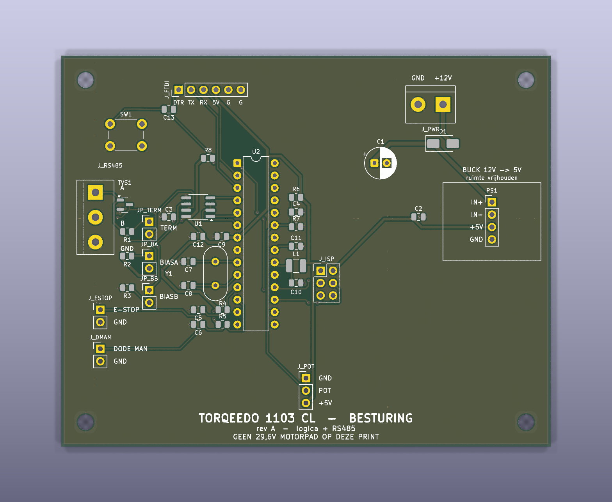
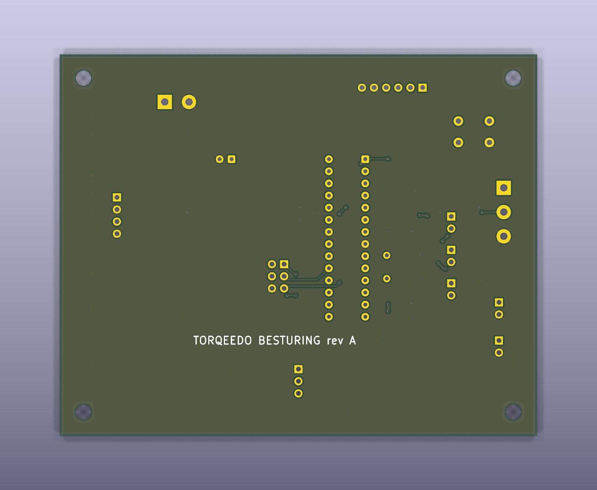

# KiCad-project — geïntegreerde besturingsprint

Schema **en** printontwerp voor de geïntegreerde besturingsprint uit
[`../../docs/pcb-geintegreerd.md`](../../docs/pcb-geintegreerd.md).

## Bestanden

| Bestand | Inhoud |
|---|---|
| `torqeedo_pcb.kicad_pro` | projectbestand — **open dit in KiCad** |
| `torqeedo_pcb.kicad_sch` | schema (netlist, footprints toegewezen) |
| `torqeedo_pcb.kicad_pcb` | **printontwerp: geplaatst, gerouteerd, massavlakken** |
| `fab/` | Gerbers + boorbestanden (`*-gerbers.zip`), BOM, plaatsingsbestand |
| `pcb-top.png` / `pcb-bottom.png` | 3D-weergave van boven- en onderkant |
| `ps1-buck-gauge.html` | pagina met de printweergaven + het meetvel voor PS1 |
| `ps1-buck-gauge.svg` | alleen het meetvel — **printen op 100 %**, schaal 1:1 |
| `tools/` | de scripts die deze print uit het schema genereren — zie [`tools/README.md`](tools/README.md) |



De symbolen zijn **in het schema ingebed**; de footprints komen uit de
**standaard KiCad-bibliotheken** (KiCad 9). Geen externe libraries nodig.

## De print

| | |
|---|---|
| Formaat | **100 × 80 mm**, 2 lagen, 1,6 mm |
| Montage | 4× **M3** (⌀3,2 mm) op 5 mm van elke hoek |
| Koperlagen | **F.Cu** = signalen, **B.Cu** = doorlopend **massavlak** (92,8 % dicht, één eiland) |
| Baanbreedtes | 0,25 mm signaal · 0,50 mm +5 V/GND · 0,80 mm +12 V |
| Via's | 0,7 mm pad / 0,35 mm boring — 32 stuks, waarvan 15 stitching-via's naar het massavlak |
| Clearance | 0,25 mm (netclasses `Default` / `Power` / `HV` staan in het projectbestand) |

De onderlaag is bewust bijna onaangeroerd gelaten: alleen een handvol korte
oversteekjes, zodat het massavlak een **aaneengesloten retourpad** blijft.

## Indeling

```
 ┌──────────────────────────────────────────────────────────┐
 │  SW1  C13   J_FTDI                          J_PWR  D1    │  ← 12 V in, ompoling
 │                                        C1        ┌─────┐ │
 │ J_RS485  TVS1  JP_*   U1      U2    R6/C4/R7  C2 │BUCK │ │  ← 12 V→5 V module
 │   A/B/G  R1-R3        MAX485  ATmega  C11        │PS1  │ │     (ruimte vrij)
 │                       C3      328P    L1/C10     └─────┘ │
 │                   C7 Y1 C8            J_ISP              │
 │ J_ESTOP    C5/C6  R4/R5                                  │
 │ J_DMAN                     J_POT                         │
 │            TORQEEDO 1103 CL - BESTURING  rev A           │
 └──────────────────────────────────────────────────────────┘
```

De plaatsing volgt de aandachtspunten uit
[`pcb-geintegreerd.md` §11](../../docs/pcb-geintegreerd.md):

- **Kristal Y1 staat pal tegen pin 9/10** van de ATmega — XTAL1 is 9,1 mm en
  XTAL2 10,0 mm lang, beide zonder via, met C7/C8 er direct naast.
- **Ontkoppeling tegen de voedingspinnen:** C9 bij VCC (pin 7), C3 bij MAX485
  pin 8, L1+C10 (AVCC-filter) direct bij pin 20, C11 bij AREF.
- **Analoge tak kort en ver van de buck:** C4/R6/R7 staan tegen pin 23; de
  A0-baan loopt op **40,9 mm** van de buck-module en 18,3 mm van het
  12 V-koper.
- **RS485 bij de connector:** terminatie (R1/JP_TERM), bias (R2/R3/JP_BA/JP_BB)
  en TVS1 staan tussen U1 en J_RS485; A en B lopen als paar.
- **Voedingsscheiding:** J_PWR, D1, C1 en de buck zitten samen in de
  rechterbovenhoek, gescheiden van de 5 V-logica en de A0-lijn.
- **Veldbedrading** (RS485, potmeter, noodstop, dode man) zit aan de linker- en
  onderrand; **programmeerheaders** (J_FTDI, J_ISP) liggen vrij bereikbaar.

Op de silkscreen staan de aansluitingen benoemd (`+12V`/`GND`, `A`/`B`/`GND`,
`POT`, `E-STOP`, `DODE MAN`, `IN+`/`IN-`/`+5V`/`GND`, `DTR TX RX 5V G G`), plus
het gereserveerde vlak voor de buck-module.



## Verificatiestatus

Gecontroleerd met KiCad 9.0.2:

- **DRC: 0 overtredingen, 0 onverbonden items** (inclusief silkscreen- en
  afbakeningsregels).
- **Netlist print = netlist schema:** alle **114 pad-net-verbindingen** en 39
  componenten komen exact overeen; geen footprint-afwijkingen.
- Alle silkscreen-tekst valt binnen de bordrand.

> Dit is een **ontwerp-verificatie, geen gebouwde print.** Zie hieronder wat je
> vóór bestellen zelf moet nakijken.

## Nakijken vóór je bestelt

1. **PS1 buck-module — moet hoe dan ook nog veranderen.** De 1×4 header is een
   *placeholder* uit het schema: vier pads op één rij, 2,54 mm, 7,62 mm totaal.
   Een MP1584EN-achtige module zet het ingangspaar aan de ene kant van een 22 mm
   print en het uitgangspaar aan de andere — dat past daar niet in. Dit is dus een
   **nieuwe footprint**, geen omgewisselde pinvolgorde.

   Er is geen betrouwbare maatvoering te vinden: verkopers noemen allemaal
   22 × 17 × 4 mm, maar **niemand publiceert gatposities**, en ze verschillen per
   batch. Meet daarom je eigen module met
   [`ps1-buck-gauge.svg`](ps1-buck-gauge.svg) — print op **100 %** (niet
   "passend maken"), controleer eerst de kalibratiebalk op 100,0 mm, en lees op
   het 1 mm-raster de vier gatposities af.

   Het silkscreen-kader (20 × 16 mm) is de ruimte die de module nu krijgt.
2. **TVS1 SM712** — aangenomen SOT-23-pinout is pin 1 = A, 2 = GND, 3 = B.
   Controleer tegen het datasheet (optioneel onderdeel, dus laag risico).
3. **D1** — kathode (band) hoort aan de `+12V_PROT`-kant; zo is hij bedraad,
   controleer de silk-oriëntatie.
4. **C2/C12 (10 µF)** staan als keramisch 0805. Wil je elco's, wijs dan
   `CP_Radial` toe en let op polariteit.
5. **J_FTDI VCC** — laat los als de print al via de buck gevoed wordt
   (zie [`pcb-geintegreerd.md` §5](../../docs/pcb-geintegreerd.md)).

## Fabricagebestanden opnieuw maken

```sh
kicad-cli pcb export gerbers --no-protel-ext \
  --layers F.Cu,B.Cu,F.Mask,B.Mask,F.Silkscreen,B.Silkscreen,F.Paste,Edge.Cuts \
  -o fab/ torqeedo_pcb.kicad_pcb
kicad-cli pcb export drill --format excellon --excellon-separate-th -o fab/ torqeedo_pcb.kicad_pcb
kicad-cli pcb export pos --format csv --units mm --side both -o fab/torqeedo_pcb-pos.csv torqeedo_pcb.kicad_pcb
kicad-cli pcb drc --severity-error --severity-warning torqeedo_pcb.kicad_pcb
```

`fab/torqeedo_pcb-gerbers.zip` is wat je bij een fabrikant (JLCPCB, Aisler,
Eurocircuits) uploadt. Standaard 2-laags 1,6 mm proces; de kleinste maten op de
print (0,25 mm baan, 0,35 mm boring) zitten ruim binnen wat iedereen aankan.

## Bekende oneffenheid

De referenties `J_PWR`, `J_POT`, `JP_BA`, … eindigen niet op een cijfer. KiCad
ziet zulke namen als **niet-geannoteerd** en meldt dat bij het openen van het
schema; in de BOM verschijnen ze als `J_PWR?`. Dat is **cosmetisch** — netlist,
print en fabricagebestanden zijn correct (de print gebruikt de namen zonder
`?`). Wil je het weg hebben, hernoem dan in het schema naar bijvoorbeeld
`J_PWR1`; dan moeten de verwijzingen in `docs/pcb-geintegreerd.md` mee.

---

## Waar we gebleven zijn

De print is **af en geverifieerd** (DRC 0/0, netlist gelijk aan het schema) en
staat als `pcb-rev-A` in git. Hij is **nog niet besteld**, en dat moet ook nog
niet: er is één openstaand punt.

**Geblokkeerd op:** de vier gatposities van jouw buck-module. PS1 heeft nu een
placeholder-footprint die sowieso niet klopt (zie *Nakijken vóór je bestelt*,
punt 1). Meet de module met [`ps1-buck-gauge.svg`](ps1-buck-gauge.svg) — printen
op 100 %, eerst de kalibratiebalk op 100,0 mm controleren.

**Zodra die vier coördinaten er zijn:**

1. PS1 wordt **twee 1×2-headers** in plaats van één blok, zodat de module in een
   voetje zit en er zonder soldeerbout af kan — op een boot telt dat zwaarder
   dan op een bureau, en korte draadbruggen vangen een millimeter afwijking op.
2. `place.py` (tabel `PLACE`) en het silkscreen-kader in `finish.py` aanpassen.
3. `./tools/regenerate.sh` draaien tot hij schoon is, dan `--install`.
4. Gerbers opnieuw exporteren en taggen als `pcb-rev-B`. `pcb-rev-A` blijft staan.

De overige vier punten uit *Nakijken vóór je bestelt* (TVS1-pinout,
D1-oriëntatie, C2/C12, J_FTDI VCC) zijn nog niet nagelopen.
